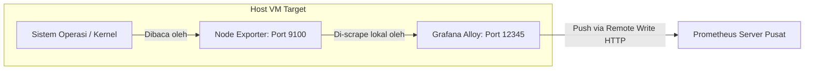

# Panduan Konfigurasi Monitoring Sederhana: Grafana Alloy + Node Exporter (Pure Setup)

Dokumentasi ini menjelaskan langkah-langkah instalasi dan konfigurasi sistem monitoring minimalis di server baru menggunakan kombinasi **Node Exporter** (sebagai produsen metrik OS) dan **Grafana Alloy** (sebagai agen pengumpul & pengirim metrik). 

Setup ini bersifat *pure* (murni), artinya **tidak memerlukan skrip cronjob tambahan atau exporter pihak ketiga lainnya** (seperti cAdvisor, Grok, PM2, atau Process Exporter). Metrik yang tidak terjangkau akan dialihkan sebagai `"unavailable"` pada laporan akhir.

---

## 1. Arsitektur Aliran Data (Architecture)



*   **Node Exporter** berjalan secara internal di port `9100` untuk memantau performa sistem operasi dan kesehatan layanan systemd.
*   **Grafana Alloy** berjalan di port `12345`, bertindak secara aktif untuk mengambil metrik dari Node Exporter lokal, kemudian mengirimkannya (*push*) ke Prometheus Pusat menggunakan protokol *Remote Write*.

---

## 2. File Konfigurasi di Server Target

Buat folder baru untuk monitoring di server target Anda (misal: `~/monitoring`), lalu buat dua file berikut di dalamnya:

### A. `config.alloy`
Konfigurasi HCL (HashiCorp Configuration Language) untuk mem-forward data hasil scrape Node Exporter ke Prometheus pusat:

```hcl
// 1. Scrape data dari Node Exporter lokal (Port 9100)
prometheus.scrape "scrape_node_exporter" {
  targets = [
    {"__address__" = "localhost:9100", "job" = "node-exporter"}
  ]
  forward_to = [prometheus.remote_write.prometheus_pusat.receiver]
}

// 2. Kirim data ke Prometheus Pusat (Remote Write)
prometheus.remote_write "prometheus_pusat" {
  endpoint {
    // Ganti IP di bawah dengan alamat IP Prometheus Pusat Anda
    url = "http://<IP_PROMETHEUS_PUSAT>:9090/api/v1/write"
  }
}
```

### B. `docker-compose.yml`
File Docker Compose untuk mendefinisikan dan menjalankan kontainer Node Exporter serta Grafana Alloy secara bersamaan:

```yaml
version: '3.8'

services:
  # 1. Node Exporter Standar
  node-exporter:
    image: prom/node-exporter:latest
    container_name: node-exporter
    restart: unless-stopped
    security_opt:
      - apparmor:unconfined
    volumes:
      - /proc:/host/proc:ro
      - /sys:/host/sys:ro
      - /:/rootfs:ro
      - /var/run/dbus/system_bus_socket:/var/run/dbus/system_bus_socket:ro
    command:
      - '--path.procfs=/host/proc'
      - '--path.rootfs=/host/rootfs'
      - '--path.sysfs=/host/sys'
      - '--collector.systemd' # Aktifkan pemantauan status unit/service Systemd
    network_mode: "host"

  # 2. Grafana Alloy Agent
  alloy:
    image: grafana/alloy:latest
    container_name: grafana-alloy
    restart: unless-stopped
    volumes:
      - ./config.alloy:/etc/alloy/config.alloy:ro
    entrypoint:
      - /bin/alloy
      - run
      - --storage.path=/var/lib/alloy/data
      - --server.http.listen-addr=0.0.0.0:12345 # Membuka akses internal untuk Prometheus
      - /etc/alloy/config.alloy
    network_mode: "host"
```

---

## 3. Langkah-Langkah Deploy di Server Target

1.  Masuk ke server target menggunakan SSH.
2.  Buat folder baru dan masuk ke dalamnya:
    ```bash
    mkdir -p ~/monitoring && cd ~/monitoring
    ```
3.  Buat file `config.alloy` dan isi sesuai konfigurasi di atas.
4.  Buat file `docker-compose.yml` dan isi sesuai konfigurasi di atas.
5.  Jalankan seluruh layanan menggunakan Docker Compose:
    ```bash
    docker compose up -d
    ```
6.  Pastikan kontainer berjalan lancar dengan mengecek log Alloy:
    ```bash
    docker logs -f grafana-alloy
    ```
    *(Log sukses akan memunculkan tulisan `Alloy is running` dan `Done replaying WAL`).*

---

## 4. Konfigurasi di Sisi Prometheus Pusat

Agar Prometheus Pusat Anda siap menerima data yang dikirimkan oleh Grafana Alloy, pastikan parameter **`--web.enable-remote-write-receiver`** telah diaktifkan saat memulai server Prometheus.

Jika Prometheus berjalan di dalam Docker, tambahkan parameter tersebut pada kolom `command`:
```yaml
  prometheus:
    image: prom/prometheus:latest
    command:
      - '--config.file=/etc/prometheus/prometheus.yml'
      - '--web.enable-remote-write-receiver' # <-- Wajib Aktif
```

---

## 5. Pemetaan Metrik Laporan Notion & Query PromQL

Berikut adalah query PromQL dari hasil monitoring murni ini yang dapat Anda panggil di n8n untuk memperbarui halaman Notion Anda:

| Bagian Laporan Notion | Status Metrik | Query PromQL / Keterangan |
| :--- | :--- | :--- |
| **3.1 CPU Usage** | ✅ **Aktif** | `100 - (avg(rate(node_cpu_seconds_total{mode="idle"}[5m])) * 100)` |
| **3.2 Memory & Swap** | ✅ **Aktif** | `(1 - (node_memory_MemAvailable_bytes / node_memory_MemTotal_bytes)) * 100` |
| **3.2 Top RAM Processes** | ❌ *Unavailable* | Tidak tersedia karena tidak menggunakan Process Exporter. |
| **3.3 Disk Capacity** | ✅ **Aktif** | `(1 - (node_filesystem_free_bytes{mountpoint="/"} / node_filesystem_size_bytes{mountpoint="/"})) * 100` |
| **3.3 Top 5 Folders** | ❌ *Unavailable* | Tidak tersedia karena tidak menggunakan skrip cronjob `du`. |
| **3.4 Network Traffic** | ✅ **Aktif** | `sum(rate(node_network_receive_bytes_total{device!~"lo"}[5m])) * 8 / 1000000` (Mbps) |
| **4.1 Systemd Services** | ✅ **Aktif** | `node_systemd_unit_state{name="nginx.service", state="active"}` (1 = Active, 0 = Down) |
| **4.1 Zombie Processes** | ✅ **Aktif** | `node_processes_zombies` |
| **4.2 PM2 Health** | ❌ *Unavailable* | Tidak tersedia karena tidak memasang PM2 Exporter. |
| **4.3 Docker Health** | ❌ *Unavailable* | Tidak tersedia karena tidak menggunakan cAdvisor / cronjob Docker. |
| **4.4 Cronjob Audit** | ❌ *Unavailable* | Tidak tersedia karena tidak menggunakan skrip cronjob audit. |
| **5. Security Audit (SSH)**| ❌ *Unavailable* | Tidak tersedia karena tidak menggunakan Grok Exporter. |
| **6. Log Management** | ❌ *Unavailable* | Tidak tersedia karena tidak menggunakan Grok Exporter. |
| **9. OS / Kernel Version** | ✅ **Aktif** | `node_uname_info` |
