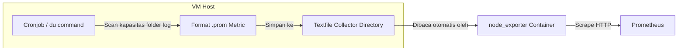

# Panduan Eksportir Top 5 File/Folder Terbesar ke Prometheus (via Textfile Collector)

Dokumentasi ini menjelaskan langkah-langkah untuk memantau kapasitas penyimpanan 5 file atau folder terbesar (dalam kasus ini di direktori `/var/log/*`) secara dinamis, lalu mengekspornya ke Prometheus menggunakan **`node_exporter` Textfile Collector** tanpa menggunakan *command execute* dari n8n.

---

## Alur Kerja (Workflow)



---

## Langkah 1: Pembuatan Skrip Bash Pemindai Folder Terbesar

Skrip ini akan memindai folder log `/var/log/*`, menyortirnya dari yang terbesar, mengambil 5 teratas, mengonversi kapasitasnya ke ukuran desimal bytes, lalu mencatatnya sebagai metrik berlabel jalur (*path*) folder tersebut.

1. Buat file baru di direktori `/usr/local/bin/`:
   ```bash
   sudo nano /usr/local/bin/collect_top_files.sh
   ```

2. Tempelkan kode skrip berikut:
   ```bash
   #!/bin/bash
   # Folder penampung metrik milik node_exporter
   TEXTFILE_DIR="/var/lib/node_exporter/textfile_collector"
   
   # Pastikan folder tujuan ada
   mkdir -p $TEXTFILE_DIR
   
   # Buat file metrik sementara (.tmp)
   TEMP_FILE="$TEXTFILE_DIR/top_files.prom.tmp"
   
   echo "# HELP node_dir_file_size_bytes Ukuran file atau folder dalam bytes" > $TEMP_FILE
   echo "# TYPE node_dir_file_size_bytes gauge" >> $TEMP_FILE
   
   # Cari 5 file/folder terbesar di /var/log/ dan tulis ke metrik dalam satuan bytes
   du -sB 1 /var/log/* 2>/dev/null | sort -rn | head -n 5 | while read -r size path; do
     if [ ! -z "$path" ]; then
       echo "node_dir_file_size_bytes{path=\"$path\"} $size" >> $TEMP_FILE
     fi
   done
   
   # Pindahkan file secara instan (atomic move) ke file aktif
   mv $TEMP_FILE "$TEXTFILE_DIR/top_files.prom"
   ```

3. Simpan file (`Ctrl + O` -> `Enter`) lalu keluar dari editor (`Ctrl + X`).

4. Berikan izin eksekusi (*executable permission*) pada skrip:
   ```bash
   sudo chmod +x /usr/local/bin/collect_top_files.sh
   ```

---

## Langkah 2: Menjadwalkan Skrip di Cronjob

Agar kapasitas folder dipindai dan diperbarui secara berkala, daftarkan skrip ini ke dalam sistem cron root.

1. Buka konfigurasi crontab:
   ```bash
   sudo crontab -e
   ```

2. Tambahkan baris jadwal berikut di bagian paling bawah file (dijalankan otomatis setiap 1 jam):
   ```cron
   0 * * * * /usr/local/bin/collect_top_files.sh
   ```

3. Simpan dan keluar dari editor crontab.

4. **Jalankan skrip secara manual pertama kali** agar file metrik langsung terbuat sekarang tanpa menunggu jadwal jam berikutnya:
   ```bash
   sudo /usr/local/bin/collect_top_files.sh
   ```

---

## Langkah 3: Konfigurasi Volume Mount di `node-exporter` (Docker Compose)

Pastikan container `node-exporter` Anda sudah terhubung ke direktori `/var/lib/node_exporter/textfile_collector` host agar bisa membaca file `.prom` yang dihasilkan oleh skrip di atas.

1. Buka file `docker-compose.yml`:
   ```bash
   nano ~/monitoring/docker-compose.yml
   ```

2. Pastikan di dalam `volumes` bagian `node-exporter` sudah di-mount seperti berikut:
   ```yaml
       volumes:
         - /proc:/host/proc:ro
         - /sys:/host/sys:ro
         - /:/rootfs:ro
         - /var/run/dbus/system_bus_socket:/var/run/dbus/system_bus_socket:ro
         - /var/lib/node_exporter/textfile_collector:/var/lib/node_exporter/textfile_collector:ro # <-- Pastikan Baris Ini Ada
   ```

3. Jika Anda baru menambahkannya, lakukan recreate container `node-exporter`:
   ```bash
   cd ~/monitoring
   docker compose up -d --force-recreate node-exporter
   ```

---

## Langkah 4: Cara Memanggil Data di Prometheus

Setelah data terkirim ke Prometheus, Anda dapat memverifikasi dan menampilkan data 5 folder terbesar tersebut menggunakan query PromQL berikut di Prometheus Web UI:

### Query Pemanggilan 5 Teratas
```promql
topk(5, node_dir_file_size_bytes)
```

### Penjelasan Hasil
Query ini akan menghasilkan daftar 5 metrik berlabel `{path="..."}` yang menunjukkan lokasi folder/file bersangkutan, lengkap dengan nilai kapasitasnya dalam desimal bytes (misal: `3221225472` bytes untuk folder `/var/log/syslog.1` yang setara dengan `3 GB`).
