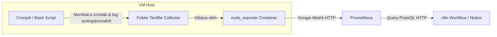

# Panduan Integrasi Pemantauan Cronjob ke Prometheus & Notion (via Textfile Collector)

Dokumentasi ini menjelaskan langkah-langkah untuk memantau daftar cronjob aktif dan melacak error eksekusi cronjob selama 24 jam terakhir secara dinamis menggunakan skrip lokal VM yang diekspor melalui **`node_exporter` Textfile Collector** tanpa bergantung pada eksekusi command CLI langsung dari n8n.

---

## Alur Kerja (Workflow)



---

## Langkah 1: Pembuatan Skrip Bash di Server Host VM

Buat skrip bash di VM untuk mengumpulkan seluruh daftar baris crontab aktif yang dijalankan oleh root, melakukan pembersihan karakter khusus untuk mematuhi format label Prometheus, menghitung total error eksekusi cron selama 24 jam terakhir, dan menyusunnya dalam format metrik.

1. Buat file baru di direktori `/usr/local/bin/`:
   ```bash
   sudo nano /usr/local/bin/collect_cron_audit.sh
   ```

2. Tempelkan kode skrip berikut:
   ```bash
   #!/bin/bash
   TEXTFILE_DIR="/var/lib/node_exporter/textfile_collector"
   TEMP_FILE="$TEXTFILE_DIR/cron_audit.prom.tmp"

   # Pastikan folder tujuan ada
   mkdir -p $TEXTFILE_DIR

   # 1. Mulai file metrik baru
   echo "# HELP node_cron_job Daftar cronjob aktif" > $TEMP_FILE
   echo "# TYPE node_cron_job gauge" >> $TEMP_FILE
   echo "# HELP node_cron_errors_total_24h Jumlah error cronjob dalam 24 jam terakhir" >> $TEMP_FILE
   echo "# TYPE node_cron_errors_total_24h gauge" >> $TEMP_FILE

   # 2. Ambil daftar cronjob root (abaikan baris komentar '#' dan baris kosong)
   crontab -l 2>/dev/null | grep -v '^#' | grep -v '^$' | while read -r line; do
       if [ ! -z "$line" ]; then
           # ESCAPE ATURAN PROMETHEUS:
           # 1. Escape backslash (\ -> \\)
           # 2. Escape double quotes (" -> \")
           escaped_line=$(echo "$line" | sed 's/\\/\\\\/g' | sed 's/"/\\"/g')
           echo "node_cron_job{job=\"$escaped_line\"} 1" >> $TEMP_FILE
       fi
   done

   # 3. Hitung jumlah error cronjob dalam 24 jam terakhir via journalctl / syslog
   if command -v journalctl >/dev/null 2>&1; then
       ERR_COUNT=$(journalctl _COMM=cron --since "24 hours ago" 2>/dev/null | grep -iE "error|fail|failed" | wc -l)
   else
       ERR_COUNT=$(grep -iE "cron.*(error|fail)" /var/log/syslog 2>/dev/null | wc -l)
   fi
   echo "node_cron_errors_total_24h $ERR_COUNT" >> $TEMP_FILE

   # Pindahkan secara instan ke file aktif
   mv $TEMP_FILE "$TEXTFILE_DIR/cron_audit.prom"
   ```

3. Simpan file (`Ctrl + O` -> `Enter`) lalu keluar dari editor (`Ctrl + X`).

4. Berikan izin eksekusi (*executable permission*) pada skrip:
   ```bash
   sudo chmod +x /usr/local/bin/collect_cron_audit.sh
   ```

5. **Jalankan skrip secara manual pertama kali** agar file metrik pertamanya langsung terbuat:
   ```bash
   sudo /usr/local/bin/collect_cron_audit.sh
   ```

---

## Langkah 2: Menjadwalkan Perekaman via Cronjob

Daftarkan skrip audit tersebut ke crontab root agar diperbarui secara berkala.

1. Masuk ke konfigurasi crontab:
   ```bash
   sudo crontab -e
   ```

2. Tambahkan baris jadwal berikut di bagian paling bawah file (dijalankan otomatis pada menit ke-5 setiap jam):
   ```cron
   5 * * * * /usr/local/bin/collect_cron_audit.sh
   ```

3. Simpan dan keluar dari editor crontab.

---

## Langkah 3: Konfigurasi di n8n & Notion Integration

### A. HTTP Request Prometheus
Konfigurasikan node HTTP Request Prometheus di n8n (contoh nama node: `Cronjob Stats`):
* **Method**: `GET`
* **URL**: `http://<IP_PROM>:9090/api/v1/query`
* **Query Parameters**:
  * `query`: `{__name__=~"node_cron_.*"}`

### B. JavaScript Parser di n8n (Pembuat Payload Notion)
Gunakan kode JavaScript berikut di node pembangun Notion block. Kode ini dirancang khusus untuk memetakan label `exported_job` (nama label `job` yang secara otomatis di-rename oleh Prometheus agar tidak bentrok dengan label internal target):

```javascript
// Ambil data hasil query dari node "Cronjob Stats"
const promeResult = $('Cronjob Stats').first()?.json?.data?.result || [];

// Ambil daftar cronjob aktif (membaca label exported_job)
const cronJobs = promeResult
  .filter(item => item.metric.__name__ === 'node_cron_job')
  .map(item => item.metric.exported_job || item.metric.job)
  .join('\n');

// Ambil jumlah error cron dalam 24 jam terakhir
const errorCountRaw = promeResult.find(item => item.metric.__name__ === 'node_cron_errors_total_24h')?.value[1] || "0";
const errorCount = parseInt(errorCountRaw);

const cronFailingStatus = errorCount > 0 
  ? `Terdeteksi ${errorCount} error dalam 24 jam terakhir` 
  : "Tidak ada log kegagalan (0 error 24 jam terakhir)";

// Ambil rekomendasi dari node AI
const aiNotes = $('HTTP Request7').first()?.json?.choices[0]?.message?.content?.replace(/\*\*/g, '') || "Semua cronjob berjalan sesuai jadwal.";

return {
  "children": [
    {
      "object": "block",
      "type": "bulleted_list_item",
      "bulleted_list_item": {
        "rich_text": [{ "type": "text", "text": { "content": "Cronjob list:" } }]
      }
    },
    {
      "object": "block",
      "type": "code",
      "code": {
        "language": "plain text",
        "rich_text": [{ "type": "text", "text": { "content": cronJobs || "Tidak ada cronjob aktif." } }]
      }
    },
    {
      "object": "block",
      "type": "bulleted_list_item",
      "bulleted_list_item": {
        "rich_text": [{ "type": "text", "text": { "content": "Cronjob failing?: " + cronFailingStatus } }]
      }
    },
    {
      "object": "block",
      "type": "bulleted_list_item",
      "bulleted_list_item": {
        "rich_text": [{ "type": "text", "text": { "content": "Perubahan jadwal?: Tidak ada perubahan jadwal baru" } }]
      }
    },
    {
      "object": "block",
      "type": "bulleted_list_item",
      "bulleted_list_item": {
        "rich_text": [{ "type": "text", "text": { "content": "Notes: " + aiNotes } }]
      }
    }
  ]
};
```
