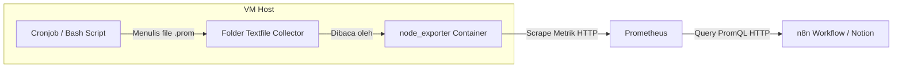

# Panduan Integrasi Pemantauan Docker Storage & Health ke Prometheus (via Textfile Collector)

Dokumentasi ini menjelaskan langkah-langkah untuk memantau status penyimpanan Docker (ukuran volume, image, reclaimable space), jumlah kontainer berjalan, status uptime (running), restart count, serta ukuran writable & virtual layer kontainer secara detail menggunakan skrip cronjob lokal VM yang diekspor melalui **`node_exporter` Textfile Collector** tanpa bergantung pada cAdvisor atau perintah *CLI execution* langsung dari n8n.

---

## Alur Kerja (Workflow)



---

## Langkah 1: Pembuatan Skrip Bash di Server Host VM

Buat skrip bash di VM untuk mengumpulkan status Docker Engine, mengidentifikasi setiap container yang aktif beserta status uptime, jumlah restart, dan kapasitas data penyimpanannya, kemudian menyusun format metrik sesuai standar Prometheus.

1. Buat file baru di direktori `/usr/local/bin/`:
   ```bash
   sudo nano /usr/local/bin/collect_docker_details.sh
   ```

2. Tempelkan kode skrip berikut:
   ```bash
   #!/bin/bash
   TEXTFILE_DIR="/var/lib/node_exporter/textfile_collector"
   TEMP_FILE="$TEXTFILE_DIR/docker_details.prom.tmp"

   # Pastikan folder tujuan ada
   mkdir -p $TEXTFILE_DIR

   # 1. Mulai file metrik baru dengan anotasi deskripsi
   echo "# HELP node_docker_container_info Informasi status dan restart container" > $TEMP_FILE
   echo "# TYPE node_docker_container_info gauge" >> $TEMP_FILE
   echo "# HELP node_docker_container_writable_bytes Ukuran writable layer container dalam bytes" >> $TEMP_FILE
   echo "# TYPE node_docker_container_writable_bytes gauge" >> $TEMP_FILE
   echo "# HELP node_docker_container_virtual_bytes Ukuran virtual container dalam bytes" >> $TEMP_FILE
   echo "# TYPE node_docker_container_virtual_bytes gauge" >> $TEMP_FILE

   # 2. Ambil Jumlah Container Aktif (Running)
   RUNNING_COUNT=$(docker ps -q | wc -l)
   echo "# HELP node_docker_containers_running Number of running docker containers" >> $TEMP_FILE
   echo "node_docker_containers_running $RUNNING_COUNT" >> $TEMP_FILE

   # 3. Ambil data Penyimpanan Global (Volume, Image, Reclaimable)
   VOL_SIZE_RAW=$(docker system df --format "{{.Size}}" | sed -n '3p' | sed 's/B$//g')
   VOL_SIZE=$(numfmt --from=iec $VOL_SIZE_RAW 2>/dev/null || echo 0)
   VOL_COUNT=$(docker volume ls -q | wc -l)

   IMG_SIZE_RAW=$(docker system df --format "{{.Size}}" | sed -n '1p' | sed 's/B$//g')
   IMG_SIZE=$(numfmt --from=iec $IMG_SIZE_RAW 2>/dev/null || echo 0)
   IMG_COUNT=$(docker images -q | uniq | wc -l)

   RECLAIM_RAW=$(docker system df --format "{{.Reclaimable}}" | sed -n '1p' | cut -d' ' -f1 | sed 's/B$//g')
   RECLAIMABLE=$(numfmt --from=iec $RECLAIM_RAW 2>/dev/null || echo 0)

   echo "node_docker_volumes_size_bytes $VOL_SIZE" >> $TEMP_FILE
   echo "node_docker_volumes_count $VOL_COUNT" >> $TEMP_FILE
   echo "node_docker_images_size_bytes $IMG_SIZE" >> $TEMP_FILE
   echo "node_docker_images_count $IMG_COUNT" >> $TEMP_FILE
   echo "node_docker_reclaimable_size_bytes $RECLAIMABLE" >> $TEMP_FILE

   # 4. Ambil detail tiap kontainer menggunakan pemisah ";" (Semicolon)
   docker ps -a --format '{{.Names}};{{.Status}};{{.RestartCount}};{{.Size}}' | while read -r line; do
       if [ ! -z "$line" ]; then
           # Pisahkan kolom menggunakan semicolon
           IFS=';' read -r name status restarts size_raw <<< "$line"
           
           # Ekstrak ukuran dari format "0B (virtual 1.2GB)"
           writable_raw=$(echo "$size_raw" | awk '{print $1}' | sed 's/B$//g')
           virtual_raw=$(echo "$size_raw" | grep -o 'virtual [^)]*' | sed 's/virtual //g' | sed 's/B$//g')
           
           writable_bytes=$(numfmt --from=iec $writable_raw 2>/dev/null || echo 0)
           virtual_bytes=$(numfmt --from=iec $virtual_raw 2>/dev/null || echo 0)
           
           # Ekspor informasi teks ke label metrik
           echo "node_docker_container_info{container=\"$name\",status=\"$status\",restarts=\"$restarts\"} 1" >> $TEMP_FILE
           echo "node_docker_container_writable_bytes{container=\"$name\"} $writable_bytes" >> $TEMP_FILE
           echo "node_docker_container_virtual_bytes{container=\"$name\"} $virtual_bytes" >> $TEMP_FILE
       fi
   done

   # Pindahkan secara instan ke file aktif agar tidak terjadi race condition saat dibaca
   mv $TEMP_FILE "$TEXTFILE_DIR/docker_details.prom"
   ```

3. Simpan file (`Ctrl + O` -> `Enter`) lalu keluar dari editor (`Ctrl + X`).

4. Berikan izin eksekusi (*executable permission*) pada skrip:
   ```bash
   sudo chmod +x /usr/local/bin/collect_docker_details.sh
   ```

---

## Langkah 2: Menjadwalkan Perekaman via Cronjob

Agar data metrik diperbarui secara berkala di latar belakang, daftarkan skrip tersebut ke cron daemon sistem host.

1. Masuk ke konfigurasi cron root:
   ```bash
   sudo crontab -e
   ```

2. Tambahkan baris jadwal berikut di bagian paling bawah file (dijalankan otomatis setiap jam):
   ```cron
   0 * * * * /usr/local/bin/collect_docker_details.sh
   ```

3. Simpan dan keluar dari editor crontab.

4. **Jalankan skrip secara manual pertama kali** agar file metrik pertamanya langsung terbuat tanpa menunggu jadwal jam berikutnya:
   ```bash
   sudo /usr/local/bin/collect_docker_details.sh
   ```

---

## Langkah 3: Konfigurasi Volume Mount di `node-exporter` (Docker Compose)

Karena `node-exporter` berjalan di dalam container Docker, kita harus menghubungkan direktori penampung file `.prom` dari host VM ke dalam container.

1. Buka file `docker-compose.yml` Anda (misal di folder `~/monitoring`):
   ```bash
   nano ~/monitoring/docker-compose.yml
   ```

2. Pada bagian `services` -> `node-exporter` -> `volumes`, pastikan baris berikut sudah ada di bagian list volume:
   ```yaml
       volumes:
         - /proc:/host/proc:ro
         - /sys:/host/sys:ro
         - /:/rootfs:ro
         - /var/run/dbus/system_bus_socket:/var/run/dbus/system_bus_socket:ro
         - /var/lib/node_exporter/textfile_collector:/var/lib/node_exporter/textfile_collector:ro # <-- Pastikan Baris Ini Ada
   ```

3. Pastikan pada bagian `command` `node-exporter` sudah menyertakan flag direktori textfile:
   ```yaml
       command:
         - '--collector.textfile.directory=/var/lib/node_exporter/textfile_collector'
   ```

4. Simpan file lalu keluar, kemudian jalankan ulang container `node-exporter` jika Anda baru saja menambahkan konfigurasi ini:
   ```bash
   cd ~/monitoring
   docker compose up -d --force-recreate node-exporter
   ```

---

## Langkah 4: Verifikasi & Pengambilan Data di Prometheus

Setelah container `node-exporter` berjalan kembali, tunggu sekitar 10-15 detik lalu akses Prometheus Web UI Anda.

### Query Verifikasi
Jalankan query regex berikut untuk memanggil semua metrik kustom Docker secara bersamaan:
```promql
{__name__=~"node_docker_.*"}
```

### Hasil yang Diharapkan
Prometheus akan memancarkan metrik berikut:
*   `node_docker_containers_running` (Jumlah kontainer aktif)
*   `node_docker_container_info` (Label kontainer dengan `status` uptime, dan `restarts` count)
*   `node_docker_container_writable_bytes` (Ukuran write layer masing-masing kontainer)
*   `node_docker_container_virtual_bytes` (Ukuran total base + writable layer masing-masing kontainer)
*   `node_docker_volumes_count` (Jumlah volume terdaftar)
*   `node_docker_volumes_size_bytes` (Kapasitas total volume dalam bytes)
*   `node_docker_images_count` (Jumlah images terdaftar)
*   `node_docker_images_size_bytes` (Kapasitas total images dalam bytes)
*   `node_docker_reclaimable_size_bytes` (Kapasitas sampah Docker yang bisa dibersihkan dalam bytes)
