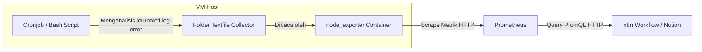

# Panduan Integrasi Pemantauan Log Management & Cleanup Tasks ke Prometheus & Notion (via Textfile Collector)

Dokumentasi ini menjelaskan langkah-langkah untuk memantau aktivitas log (mendeteksi lonjakan/spikes log error dan melacak pola error terbanyak) secara dinamis menggunakan skrip lokal VM yang diekspor melalui **`node_exporter` Textfile Collector**, serta cara membuat daftar checklist pembersihan bulanan (Monthly Cleanup Tasks) secara otomatis di Notion.

---

## Alur Kerja (Workflow)



---

## Langkah 1: Pembuatan Skrip Bash di Server Host VM

Buat skrip bash di VM untuk menghitung total log error sistem (level `err` hingga `emerg`) dalam 24 jam terakhir, menyaring 3 pola/proses penyebab error terbanyak, dan menyusun data tersebut ke format metrik Prometheus.

1. Buat file baru di direktori `/usr/local/bin/`:
   ```bash
   sudo nano /usr/local/bin/collect_log_management.sh
   ```

2. Tempelkan kode skrip berikut:
   ```bash
   #!/bin/bash
   TEXTFILE_DIR="/var/lib/node_exporter/textfile_collector"
   TEMP_FILE="$TEXTFILE_DIR/log_management.prom.tmp"

   # Pastikan folder tujuan ada
   mkdir -p $TEXTFILE_DIR

   # 1. Mulai file metrik baru
   echo "# HELP node_log_errors_total_24h Jumlah log error dalam 24 jam terakhir" > $TEMP_FILE
   echo "# TYPE node_log_errors_total_24h gauge" >> $TEMP_FILE

   # 2. Hitung total log error 24 jam terakhir (level err ke atas)
   ERRORS_COUNT=$(journalctl -p err..emerg --since "24 hours ago" 2>/dev/null | wc -l)
   echo "node_log_errors_total_24h $ERRORS_COUNT" >> $TEMP_FILE

   # 3. Cari 3 pola error terbanyak (mengelompokkan berdasarkan nama process + PID)
   ERROR_PATTERNS=$(journalctl -p err..emerg --since "24 hours ago" --no-pager 2>/dev/null | awk '{print $5}' | grep -v '^$' | sort | uniq -c | sort -nr | head -n 3 | awk '{print $1 " " $2}' | paste -sd ", " -)

   if [ -z "$ERROR_PATTERNS" ]; then
       ERROR_PATTERNS="Tidak ada error terdeteksi"
   fi

   # ESCAPE ATURAN PROMETHEUS:
   # 1. Escape backslash (\ -> \\)
   # 2. Escape double quotes (" -> \")
   clean_patterns=$(echo "$ERROR_PATTERNS" | sed 's/\\/\\\\/g' | sed 's/"/\\"/g')
   echo "node_log_error_patterns{patterns=\"$clean_patterns\"} 1" >> $TEMP_FILE

   # Pindahkan secara instan ke file aktif
   mv $TEMP_FILE "$TEXTFILE_DIR/log_management.prom"
   ```

3. Simpan file (`Ctrl + O` -> `Enter`) lalu keluar dari editor (`Ctrl + X`).

4. Berikan izin eksekusi (*executable permission*) pada skrip:
   ```bash
   sudo chmod +x /usr/local/bin/collect_log_management.sh
   ```

5. **Jalankan skrip secara manual pertama kali** agar file metrik pertamanya langsung terbuat:
   ```bash
   sudo /usr/local/bin/collect_log_management.sh
   ```

---

## Langkah 2: Menjadwalkan Perekaman via Cronjob

Daftarkan skrip log tersebut ke crontab root agar diperbarui secara berkala.

1. Masuk ke konfigurasi crontab:
   ```bash
   sudo crontab -e
   ```

2. Tambahkan baris jadwal berikut di bagian paling bawah file (dijalankan otomatis pada menit ke-15 setiap jam):
   ```cron
   15 * * * * /usr/local/bin/collect_log_management.sh
   ```

3. Simpan dan keluar dari editor crontab.

---

## Langkah 3: Konfigurasi di n8n & Notion Integration

### A. HTTP Request Prometheus
Konfigurasikan node HTTP Request Prometheus di n8n (contoh nama node: `Log Stats`):
* **Method**: `GET`
* **URL**: `http://<IP_PROM>:9090/api/v1/query`
* **Query Parameters**:
  * `query`: `{__name__=~"node_log_.*"}`

### B. JavaScript Parser di n8n (Pembuat Payload Notion)
Gunakan kode JavaScript berikut di node pembangun Notion block:

```javascript
// Ambil data hasil query dari node "Log Stats"
const results = $('Log Stats').first()?.json?.data?.result || [];

// Ekstrak jumlah log error 24 jam terakhir
const errorCountRaw = results.find(item => item.metric.__name__ === 'node_log_errors_total_24h')?.value[1] || "0";
const errorCount = parseInt(errorCountRaw);

// Tentukan status log spike (misal threshold spike > 50 error)
const hasSpike = errorCount > 50 ? "Yes" : "No";
const logSpikeStatus = `${hasSpike} (${errorCount} errors terdeteksi)`;

// Ekstrak 3 pola error terbanyak (membaca label patterns)
const patternsResult = results.find(item => item.metric.__name__ === 'node_log_error_patterns');
const errorPatterns = patternsResult?.metric?.patterns || "Tidak ada error terdeteksi";

// Ambil rekomendasi dari node AI (HTTP Request9)
const aiNotes = $('HTTP Request9').first()?.json?.choices[0]?.message?.content?.replace(/\*\*/g, '') || "Aktivitas log server tergolong normal.";

return {
  "children": [
    {
      "object": "block",
      "type": "bulleted_list_item",
      "bulleted_list_item": {
        "rich_text": [{ "type": "text", "text": { "content": "Log spikes: " + logSpikeStatus } }]
      }
    },
    {
      "object": "block",
      "type": "bulleted_list_item",
      "bulleted_list_item": {
        "rich_text": [{ "type": "text", "text": { "content": "Error patterns: " + errorPatterns } }]
      }
    },
    {
      "object": "block",
      "type": "bulleted_list_item",
      "bulleted_list_item": {
        "rich_text": [{ "type": "text", "text": { "content": "Notes: " + aiNotes } }]
      }
    },
    {
      "object": "block",
      "type": "heading_3",
      "heading_3": {
        "rich_text": [{ "type": "text", "text": { "content": "6.1 Monthly Cleanup Tasks" } }]
      }
    },
    {
      "object": "block",
      "type": "bulleted_list_item",
      "bulleted_list_item": {
        "rich_text": [{ "type": "text", "text": { "content": "Checklist:" } }]
      }
    },
    {
      "object": "block",
      "type": "to_do",
      "to_do": {
        "rich_text": [{ "type": "text", "text": { "content": "Clean /tmp" } }],
        "checked": false
      }
    },
    {
      "object": "block",
      "type": "to_do",
      "to_do": {
        "rich_text": [{ "type": "text", "text": { "content": "Clean /var/log old logs" } }],
        "checked": false
      }
    },
    {
      "object": "block",
      "type": "to_do",
      "to_do": {
        "rich_text": [{ "type": "text", "text": { "content": "Docker prune" } }],
        "checked": false
      }
    },
    {
      "object": "block",
      "type": "to_do",
      "to_do": {
        "rich_text": [{ "type": "text", "text": { "content": "Remove unused backups" } }],
        "checked": false
      }
    }
  ]
};
```
