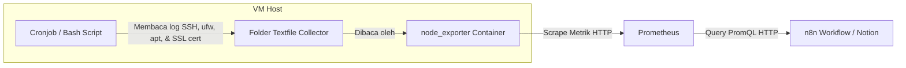

# Panduan Integrasi Pemantauan Security Audit ke Prometheus & Notion (via Textfile Collector)

Dokumentasi ini menjelaskan langkah-langkah untuk memantau status keamanan server (SSH logins, IP mencurigakan, paket update OS, SSL expiry, dan status Firewall) secara dinamis menggunakan skrip lokal VM yang diekspor melalui **`node_exporter` Textfile Collector** tanpa bergantung pada eksekusi command CLI langsung dari n8n.

---

## Alur Kerja (Workflow)



---

## Langkah 1: Pembuatan Skrip Bash di Server Host VM

Buat skrip bash di VM untuk mengumpulkan data login SSH (sukses/gagal), mencari IP penyerang (mencurigakan), menghitung jumlah update paket OS, memantau masa berlaku SSL domain utama, serta status firewall UFW.

1. Buat file baru di direktori `/usr/local/bin/`:
   ```bash
   sudo nano /usr/local/bin/collect_security_audit.sh
   ```

2. Tempelkan kode skrip berikut:
   ```bash
   #!/bin/bash
   TEXTFILE_DIR="/var/lib/node_exporter/textfile_collector"
   TEMP_FILE="$TEXTFILE_DIR/security_audit.prom.tmp"

   # Pastikan folder tujuan ada
   mkdir -p $TEXTFILE_DIR

   # 1. Mulai file metrik baru
   echo "# HELP node_security_ssh_success_24h Jumlah SSH login sukses dalam 24 jam terakhir" > $TEMP_FILE
   echo "# TYPE node_security_ssh_success_24h gauge" >> $TEMP_FILE
   echo "# HELP node_security_ssh_fail_24h Jumlah SSH login gagal dalam 24 jam terakhir" >> $TEMP_FILE
   echo "# TYPE node_security_ssh_fail_24h gauge" >> $TEMP_FILE
   echo "# HELP node_security_packages_to_update Jumlah package OS yang perlu diupdate" >> $TEMP_FILE
   echo "# TYPE node_security_packages_to_update gauge" >> $TEMP_FILE

   # 2. Hitung SSH login Sukses & Gagal (24 Jam Terakhir)
   SSH_SUCCESS=$(journalctl _COMM=sshd --since "24 hours ago" 2>/dev/null | grep -i "Accepted" | wc -l)
   SSH_FAIL=$(journalctl _COMM=sshd --since "24 hours ago" 2>/dev/null | grep -i "Failed" | wc -l)

   echo "node_security_ssh_success_24h $SSH_SUCCESS" >> $TEMP_FILE
   echo "node_security_ssh_fail_24h $SSH_FAIL" >> $TEMP_FILE

   # 3. Cari IP Mencurigakan (IP dengan percobaan login gagal terbanyak dalam 24 jam terakhir)
   SUSPICIOUS_IP=$(journalctl _COMM=sshd --since "24 hours ago" 2>/dev/null | grep -i "Failed password" | grep -oE "[0-9]{1,3}\.[0-9]{1,3}\.[0-9]{1,3}\.[0-9]{1,3}" | sort | uniq -c | sort -nr | head -n 1 | awk '{print $2}')

   if [ -z "$SUSPICIOUS_IP" ]; then
       SUSPICIOUS_IP="None"
   fi
   echo "node_security_suspicious_ip{ip=\"$SUSPICIOUS_IP\"} 1" >> $TEMP_FILE

   # 4. Cek Paket Update yang Tertunda (Apt list)
   if command -v apt >/dev/null 2>&1; then
       UPDATES=$(apt list --upgradable 2>/dev/null | grep -v "Listing..." | grep -c "/" || echo 0)
   else
       UPDATES=0
   fi
   echo "node_security_packages_to_update $UPDATES" >> $TEMP_FILE

   # 5. Cek SSL Expiry (Masukkan domain utama Anda di bawah ini)
   DOMAIN="yourdomain.com" # <--- Silakan ganti dengan domain utama server Anda
   expiry_date=$(echo | openssl s_client -connect "$DOMAIN":443 2>/dev/null | openssl x509 -noout -enddate | cut -d= -f2)
   if [ ! -z "$expiry_date" ]; then
       expiry_epoch=$(date -d "$expiry_date" +%s)
       current_epoch=$(date +%s)
       diff_days=$(( (expiry_epoch - current_epoch) / 86400 ))
       if [ $diff_days -gt 0 ]; then
           SSL_STATUS="SSL Valid (Expires in $diff_days days)"
       else
           SSL_STATUS="SSL Expired / Invalid"
       fi
   else
       SSL_STATUS="SSL Valid / Active" # Fallback jika SSL dicek secara internal
   fi
   echo "node_security_ssl_status{status=\"$SSL_STATUS\"} 1" >> $TEMP_FILE

   # 6. Cek Status Firewall (UFW)
   if command -v ufw >/dev/null 2>&1; then
       FW_STATUS=$(sudo ufw status | head -n 1 | awk '{print $2}')
   else
       FW_STATUS="inactive"
   fi
   echo "node_security_firewall_status{status=\"$FW_STATUS\"} 1" >> $TEMP_FILE

   # Pindahkan secara instan ke file aktif
   mv $TEMP_FILE "$TEXTFILE_DIR/security_audit.prom"
   ```

3. Simpan file (`Ctrl + O` -> `Enter`) lalu keluar dari editor (`Ctrl + X`).

4. Berikan izin eksekusi (*executable permission*) pada skrip:
   ```bash
   sudo chmod +x /usr/local/bin/collect_security_audit.sh
   ```

5. **Jalankan skrip secara manual pertama kali** agar file metrik pertamanya langsung terbuat:
   ```bash
   sudo /usr/local/bin/collect_security_audit.sh
   ```

---

## Langkah 2: Menjadwalkan Perekaman via Cronjob

Daftarkan skrip audit tersebut ke crontab root agar diperbarui secara berkala.

1. Masuk ke konfigurasi crontab:
   ```bash
   sudo crontab -e
   ```

2. Tambahkan baris jadwal berikut di bagian paling bawah file (dijalankan otomatis pada menit ke-10 setiap jam):
   ```cron
   10 * * * * /usr/local/bin/collect_security_audit.sh
   ```

3. Simpan dan keluar dari editor crontab.

---

## Langkah 3: Konfigurasi di n8n & Notion Integration

### A. HTTP Request Prometheus
Konfigurasikan node HTTP Request Prometheus di n8n (contoh nama node: `Security Stats`):
* **Method**: `GET`
* **URL**: `http://<IP_PROM>:9090/api/v1/query`
* **Query Parameters**:
  * `query`: `{__name__=~"node_security_.*"}`

### B. JavaScript Parser di n8n (Pembuat Payload Notion)
Gunakan kode JavaScript berikut di node pembangun Notion block:

```javascript
// Ambil data hasil query dari node "Security Stats"
const results = $('Security Stats').first()?.json?.data?.result || [];

// Ekstrak data SSH Login (Success / Fail)
const sshSuccess = results.find(item => item.metric.__name__ === 'node_security_ssh_success_24h')?.value[1] || "0";
const sshFail = results.find(item => item.metric.__name__ === 'node_security_ssh_fail_24h')?.value[1] || "0";

// Ekstrak IP Mencurigakan (Membaca label ip)
const suspiciousIpResult = results.find(item => item.metric.__name__ === 'node_security_suspicious_ip');
const suspiciousIp = suspiciousIpResult?.metric?.ip || "None";

// Ekstrak Paket Update
const updatesPending = results.find(item => item.metric.__name__ === 'node_security_packages_to_update')?.value[1] || "0";

// Ekstrak Status SSL (Membaca label status)
const sslStatusResult = results.find(item => item.metric.__name__ === 'node_security_ssl_status');
const sslStatus = sslStatusResult?.metric?.status || "SSL Valid / Active";

// Ekstrak Status Firewall (Membaca label status)
const fwStatusResult = results.find(item => item.metric.__name__ === 'node_security_firewall_status');
const fwStatus = fwStatusResult?.metric?.status || "inactive";

// Ambil rekomendasi dari node AI (HTTP Request8)
const aiNotes = $('HTTP Request8').first()?.json?.choices[0]?.message?.content?.replace(/\*\*/g, '') || "Status keamanan server tergolong aman.";

return {
  "children": [
    {
      "object": "block",
      "type": "bulleted_list_item",
      "bulleted_list_item": {
        "rich_text": [{ "type": "text", "text": { "content": `SSH login (success / fail): ${sshSuccess} Success / ${sshFail} Fail` } }]
      }
    },
    {
      "object": "block",
      "type": "bulleted_list_item",
      "bulleted_list_item": {
        "rich_text": [{ "type": "text", "text": { "content": `Suspicious IP: ${suspiciousIp}` } }]
      }
    },
    {
      "object": "block",
      "type": "bulleted_list_item",
      "bulleted_list_item": {
        "rich_text": [{ "type": "text", "text": { "content": `Update packages: ${updatesPending} packages perlu diupdate` } }]
      }
    },
    {
      "object": "block",
      "type": "bulleted_list_item",
      "bulleted_list_item": {
        "rich_text": [{ "type": "text", "text": { "content": `SSL Expiry: ${sslStatus}` } }]
      }
    },
    {
      "object": "block",
      "type": "bulleted_list_item",
      "bulleted_list_item": {
        "rich_text": [{ "type": "text", "text": { "content": `Firewall status: ${fwStatus}` } }]
      }
    },
    {
      "object": "block",
      "type": "bulleted_list_item",
      "bulleted_list_item": {
        "rich_text": [{ "type": "text", "text": { "content": "Notes: " + aiNotes } }]
      }
    }
  ]
};
```
